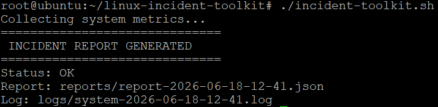
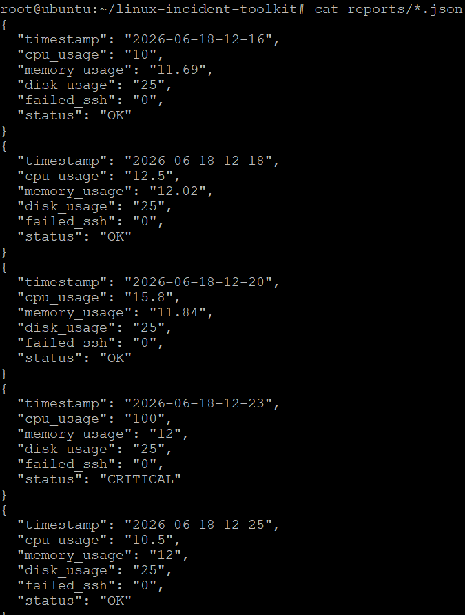
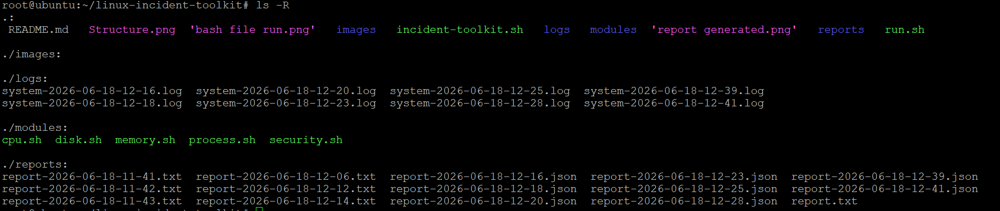

# Linux Incident Response Toolkit

## 🚀 Project Overview
This tool monitors CPU, Memory, Disk, Processes, and Security logs.

---

## 📸 Output Screenshots


### 1. Tool Execution


### 2. Report Output


### 3. Folder Structure


---

## ⚙️ How to Run

```bash
chmod +x incident-toolkit.sh
./incident-toolkit.sh
